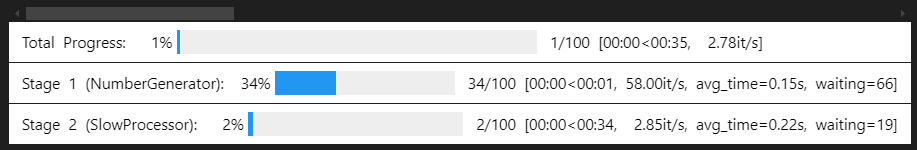

# MPipeline

A powerful and flexible Python pipeline framework for parallel processing with progress tracking capabilities.

## Features

- **Parallel Processing**: Support for both multi-threading and multi-processing
- **Progress Tracking**: Built-in progress bars using tqdm
- **Flexible Worker System**: Easy-to-implement worker classes for custom processing
- **Error Handling**: Robust error handling with detailed error propagation
- **Ordered/Unordered Results**: Option to maintain input order or get results as they complete
- **Stage-based Pipeline**: Chain multiple processing stages together
- **Async Support**: Built-in support for asynchronous processing
- **Mixed Mode Processing**: Combine thread and process modes in the same pipeline

## Installation

```bash
pip install mpipeline
```

## Quick Start

Here's a simple example of using MPipeline with thread mode:

```python
from mpipeline import Pipeline, Worker, Stage

# Define a worker
class NumberProcessor(Worker[int, int]):
    def doTask(self, inp: int) -> int:
        return inp * 2

# Create and run a pipeline with thread mode
pipeline = Pipeline(
    Stage(NumberProcessor, worker_count=4, mode='thread')
)

# Process numbers with progress tracking
results = list(pipeline.run(
    range(100),
    ordered_result=True,
    show_progress=True
))
```

## Advanced Usage

### Multi-stage Pipeline with Mixed Modes

```python
# Define multiple worker stages
class NumberGenerator(Worker[int, int]):
    def doTask(self, inp: int) -> int:
        return inp * 2

class DataProcessor(Worker[int, float]):
    def doTask(self, inp: int) -> float:
        return inp * 1.5

# Create multi-stage pipeline with mixed thread/process modes
pipeline = Pipeline(
    Stage(NumberGenerator, 
         worker_count=4, 
         mode='thread',  # Use threading for I/O-bound tasks
         worker_kwargs={'name': 'Generator'})
).then(
    Stage(DataProcessor, 
         worker_count=2, 
         mode='process',  # Use processes for CPU-bound tasks
         multiprocess_mode='spawn',  # Use spawn for better compatibility
         worker_kwargs={'name': 'Processor'})
)

# Run pipeline with all features enabled
results = pipeline.run(
    range(50),
    ordered_result=True,
    show_progress=True,
    show_stage_progress=True
)
```



### Error Handling

```python
class ErrorProneWorker(Worker[float, str]):
    def doTask(self, inp: float) -> str:
        if inp > 20:
            raise ValueError(f"Input too large: {inp}")
        return f"Processed: {inp:.1f}"

try:
    pipeline = Pipeline(
        Stage(ErrorProneWorker, worker_count=2, mode='thread')
    )
    results = list(pipeline.run(range(25)))
except Exception as e:
    print(f"Error caught: {e}")
```

## API Reference

### Pipeline

- `Pipeline(stage: Stage[T, Q])`: Create a new pipeline with an initial stage
- `then(stage: Stage[Q, Z])`: Add a new stage to the pipeline
- `run(inputs, ordered_result=True, show_progress=False, show_stage_progress=False)`: Run the pipeline

### Stage

Configure a pipeline stage with the following parameters:
- `worker_class`: The Worker class to use for this stage
- `worker_count`: Number of parallel workers (default: 1)
- `mode`: Processing mode - 'thread' or 'process' (default: 'thread')
- `multiprocess_mode`: Multiprocessing mode when using 'process' - 'spawn' or 'fork' (default: 'spawn')
- `worker_args`: Positional arguments for worker initialization
- `worker_kwargs`: Keyword arguments for worker initialization

### Worker

Base class for implementing custom workers:

- `doInit()`: Called once before processing starts
- `doTask(inp: T) -> Q`: Process a single input item
- `doDispose()`: Called once after processing ends

## Performance Tips

1. Use `mode='thread'` for I/O-bound tasks (network, disk operations)
2. Use `mode='process'` for CPU-bound tasks (heavy computation)
3. Set `ordered_result=False` for better performance when order doesn't matter
4. Use `multiprocess_mode='spawn'` for better cross-platform compatibility
5. Adjust `worker_count` based on your system's resources and task type

## Contributing

Contributions are welcome! Please feel free to submit a Pull Request.

## License

[MIT](https://opensource.org/licenses/MIT)